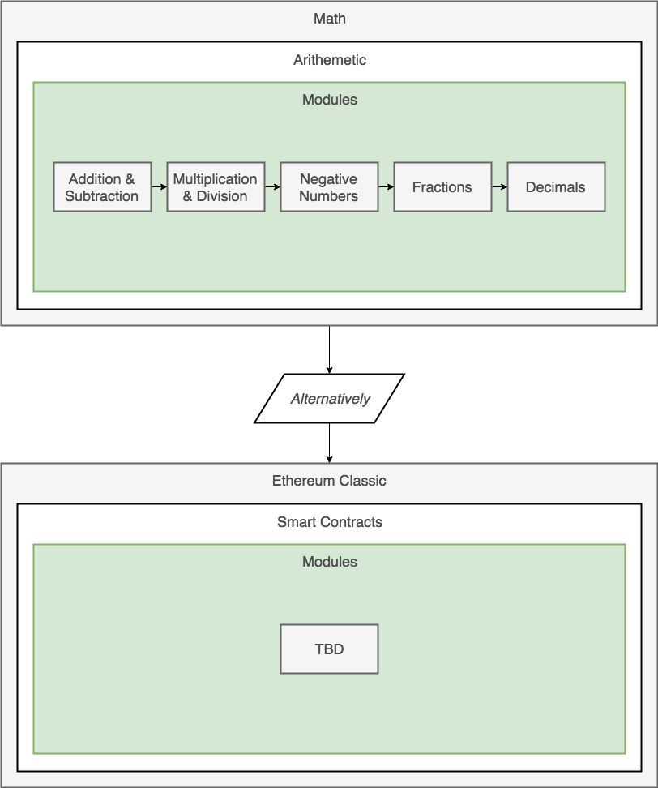

#  Technical Documentation

### Table of Contents

* [What is Technical Documentation](#anchor1)
* [Documentation for Ethereum Classic](#anchor2)

## What is Technical Documentation?

* Contains information on a particular product.
* Modular topics.
* E.g:
  * User manuals
  * Training materials
  * Help docs
  * Specifications and catalogs

All these docs provide information or guidance to do something.

### Structured Content / Standardized Content

Structured content defines the schema of the technical document. Document schema defines the elements within a technical document. Industries have different needs and requirements therefore there is no universal document schema.

### Modularity of Content

Think of modularity of content as steps to achieve a particular competency. Learning Arithmetic can be divided into modules to - *do Arithmetic*.

### Distributed Content

Technical Documentation needs to be accessible which is why tech docs are most broadly accessed through digital implementation.

## Documentation for Ethereum Classic

### Mission

To onboard new and existing developers to the Ethereum Classic ecosystem.

### Problems

* Crypto community tends to be unaware of ETH/ ETC development compatibilities.
* Ethereum and Ethereum Classic protocols tend to have legacy documentation that's not maintained.
* Crypto community tends to struggle finding educational materials to becoming ETC developers.
* dApps have higher demand than dApp developers available
* It's a valuable contribution to the ETC community 💚
* Sexier documentation is a temptation always worth exploring #YOLO

* **Decentralized Applications** `dApps` are web applications that integrate the Ethereum Classic `ETC` network to store, transmit, and interact with value.
