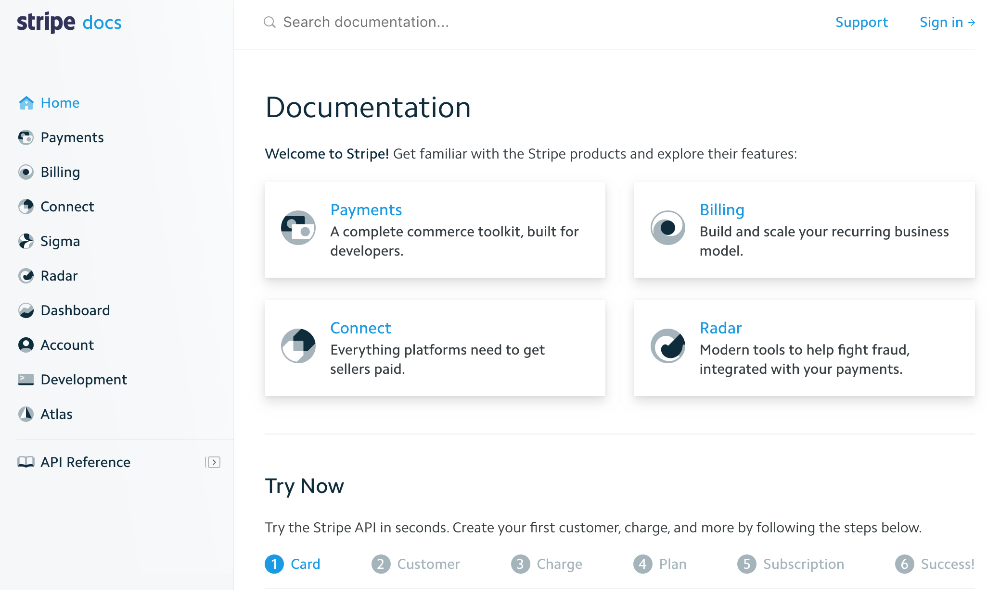
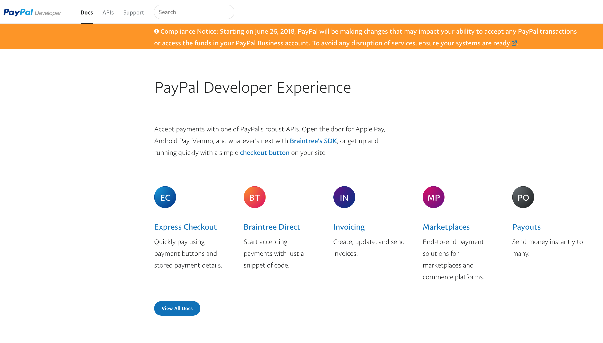
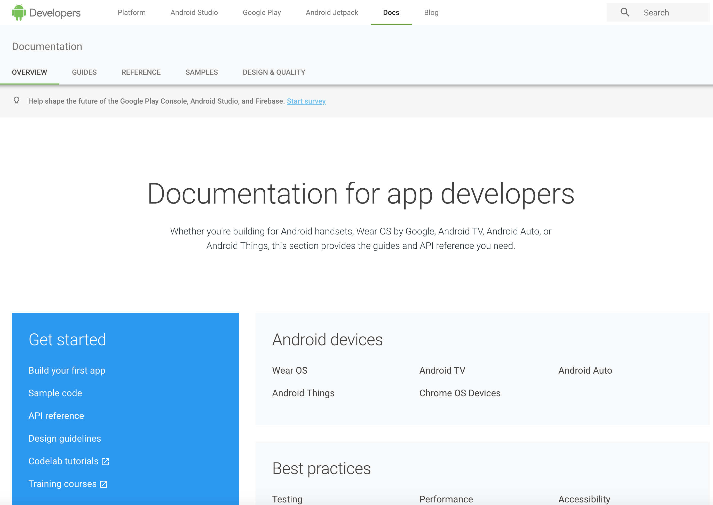
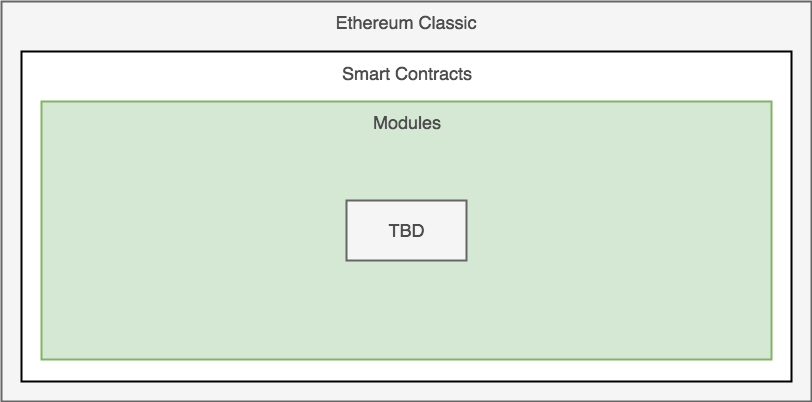

#  Technical Documentation

### Table of Contents

* [What is Technical Documentation](#anchor1)
* [Documentation for Ethereum Classic](#anchor2)

## What is Technical Documentation?

* Contains information on a particular product.
* Modular topics.
* E.g:
  * User manuals
  * Training materials
  * Help docs
  * Specifications and catalogs

All these docs provide information or guidance to do something.

### Structured Content / Standardized Content

Structured content defines the schema of the technical document. Document schema defines the elements within a technical document. Industries have different needs and requirements therefore there is no universal document schema.

### Modularity of Content

Think of modularity of content as steps to achieve a particular competency. Learning Arithmetic can be divided into modules to - *do Arithmetic*.

### Distributed Content

Technical Documentation needs to be accessible which is why tech docs are most broadly accessed through digital implementation.

# Documentation Analysis

There are many organizations with existing documentation.

**Stipe** https://stripe.com/docs

Stripe's documentation modules:

* home
  * topic/ product
    * overview
    * quick start
    * sup topic
    * . .  .
    * testing
    * checklist

Strip's document schema:

* title
* purpose one liner
* description
* sub title
* description
* examples w/ code
* next steps
* questions?

**PayPal** https://developer.paypal.com/

PayPal documentation modules

* home
  * topic/ product
    * getting started
    * sub topic
    * testing

  . . .
  * reference
    * demos
    * customizations
  * feedback

PayPal documentation schema

* title
* description
* sub title
* examples w/ code
* next steps
* feedback

**Android** https://developer.android.com/docs/

Android documentation modules *more of an sdk approach*

* overview
* guides
  * app basics
  * devices
  * core topics
  * best practives
* reference
  * [topic] library
* samples
* design
  * android design
  * guidelines

Android documentation schema

* title
* overview w/ video
* examples w/code
* next
* footer w/ license and last updated

Other recognitions:

**Salesforce** http://www.lightningdesignsystem.com/getting-started/

**Mozilla** https://design.firefox.com/photon/welcome.html

# Documentation for Ethereum Classic

### Mission

To onboard new and existing developers to the Ethereum Classic ecosystem.

### Issues

* Crypto community tends to be unaware of ETH/ ETC development compatibilities.
* Ethereum and Ethereum Classic communities tend to have legacy documentation that's not maintained.
* Crypto community tends to struggle finding educational materials to becoming ETC developers and contributing valuable projects.
* Sexier documentation is a temptation always worth exploring #YOLO

**Why do developers want use Ethereum Classic?**

Developers want to use the Ethereum Classic ecosystem to create decentralized applications.

**What should the scope of the documentation be?**

The scope of the documentation would be comprised of modules, each based on a particular competency within the dApp development process.

ex:

In a broader context
